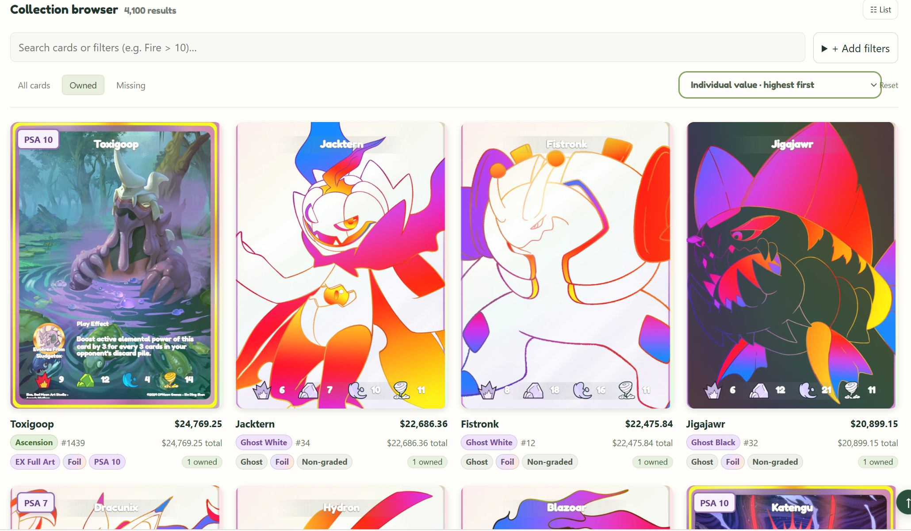
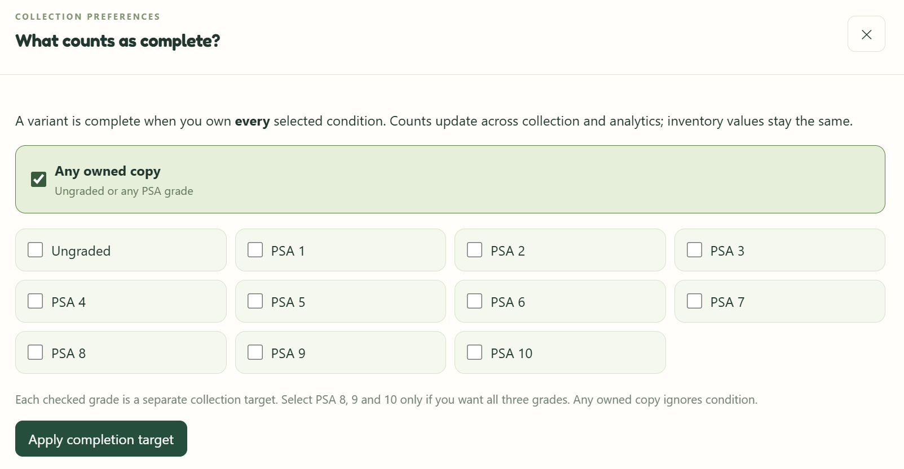
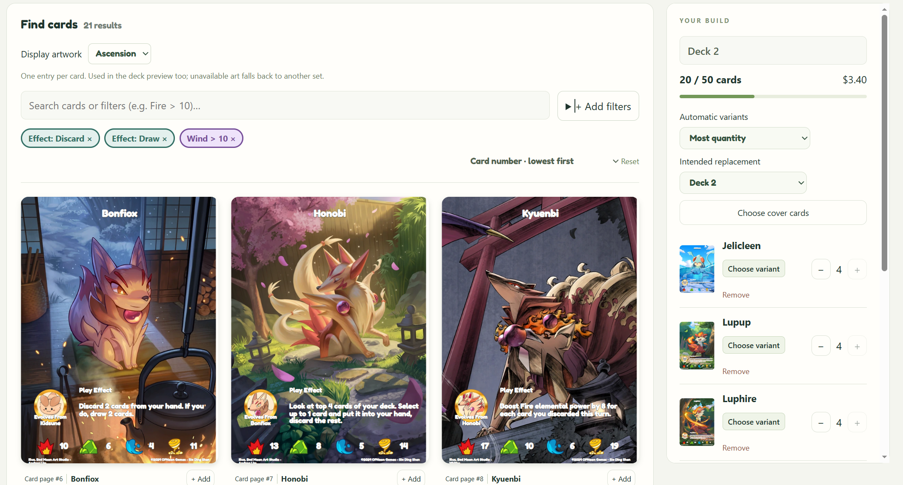
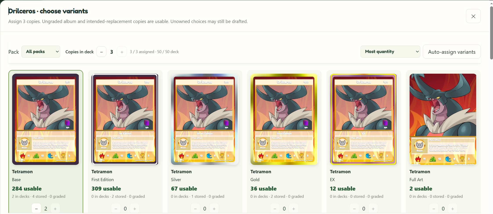
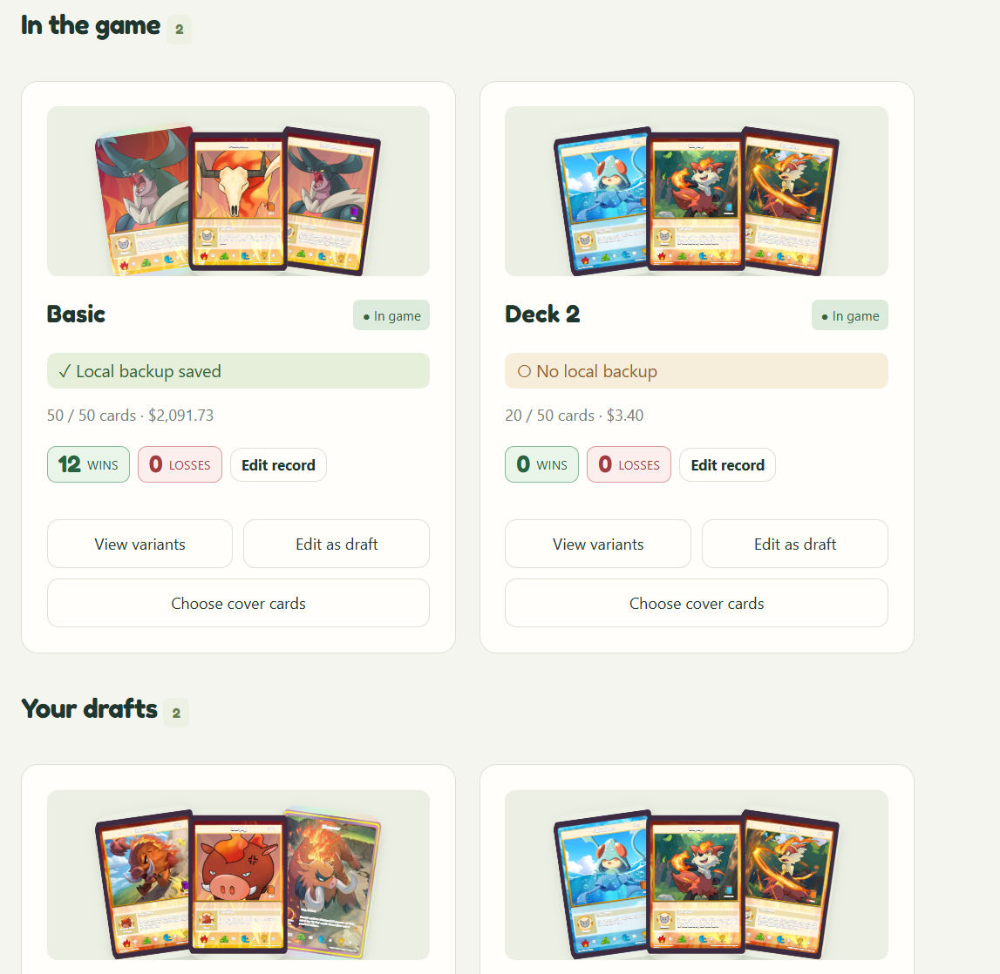
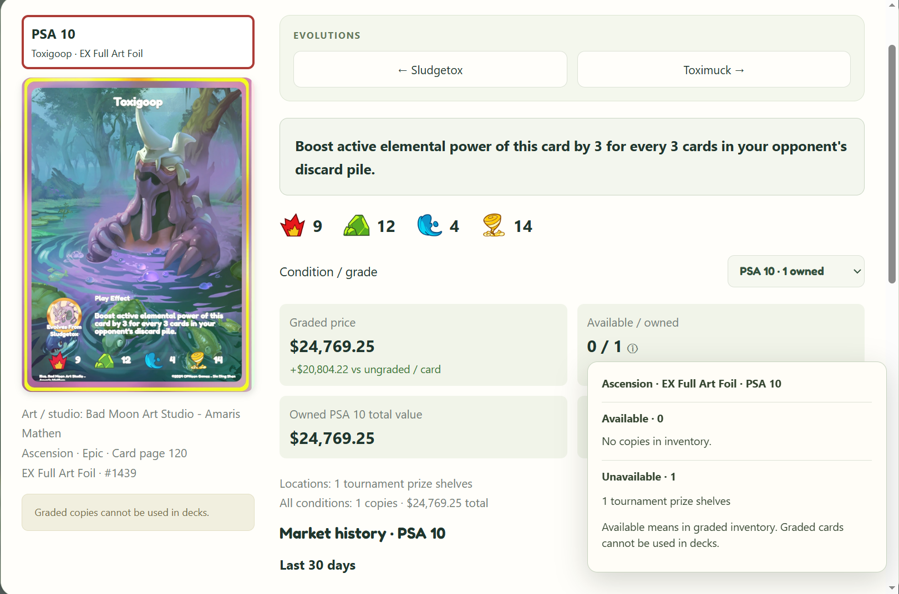
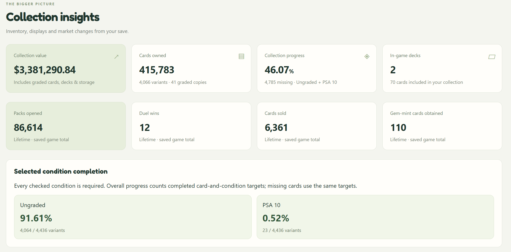
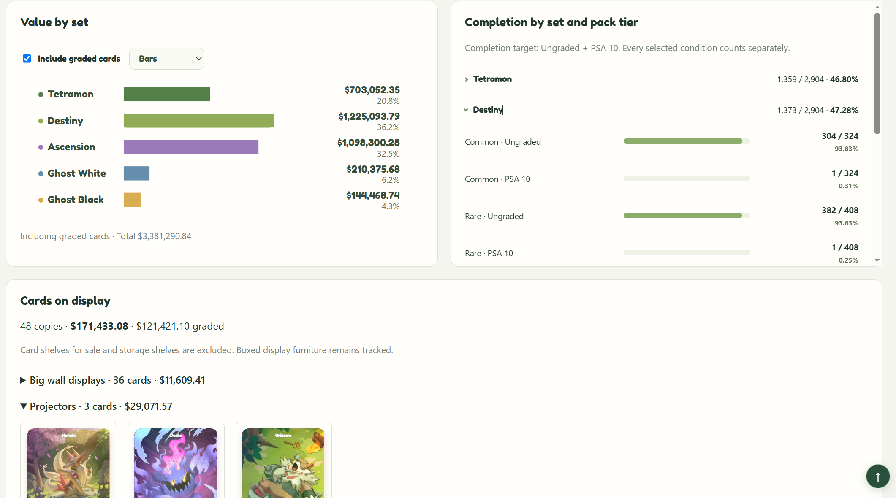

# Card Vault

Your collection, your next deck, and the bigger picture — a local companion for **TCG Card Shop Simulator**.

[Download the latest release](https://github.com/gyu123987/card-vault-tcgcardshop-tracker/releases/latest) · [Report an issue](https://github.com/gyu123987/card-vault-tcgcardshop-tracker/issues) · [Contributing](CONTRIBUTING.md)



## Get started

Both paths require Windows, a locally installed copy of TCG Card Shop Simulator, and an existing game save.

### Download from Releases — recommended

1. Download **CardVault-Windows.zip** from [Releases](https://github.com/gyu123987/card-vault-tcgcardshop-tracker/releases/latest).
2. Extract the entire ZIP, keeping the `app` and `runtime` folders beside **Card Vault.exe**.
3. Run **Card Vault.exe** and check the detected game and save folders. **On your first run, click Retrieve / refresh assets** and wait for retrieval to finish.
4. Click **Open Card Vault**. Your tracker opens in the browser; keep the launcher open while using it.

The launcher detects a missing asset cache. If you click **Open Card Vault** before retrieving assets, it starts retrieval automatically and opens the tracker after it succeeds. Refresh assets again after a game update.

Everything needed to run the app is bundled. The launcher checks for new releases and offers a download link; close it before switching to the newly extracted version. Your collection history and drafts are kept separately and carry over.

### Clone the repository — alternative

Install Git, Node.js 20+ and Python 3.12 with its Windows `py` launcher, then run:

```powershell
git clone https://github.com/gyu123987/card-vault-tcgcardshop-tracker.git
cd card-vault-tcgcardshop-tracker
.\"Start Card Vault.cmd"
```

The startup script retrieves game assets on first use and opens the local tracker. After a game update, run **Retrieve Game Assets.cmd** to refresh the artwork and catalog. See the [setup reference](docs/reference.md#setup-on-another-windows-pc--refresh-game-assets) for custom folders and troubleshooting.

## Explore your collection

Find missing cards, compare values, and filter by set, rarity, edition, foil finish, PSA grade or owned quantity. Click a tag beneath a card to add it to your filters.

Choose what completion means to you: any owned copy, ungraded copies, specific PSA grades, or several conditions together. Every selected condition becomes its own target.

<details>
<summary>See completion preferences</summary>



</details>

## Build your next deck

Search by card effects, elements and evolution lines, then choose the exact variants you want to play. Automatic assignment can prefer the most plentiful, cheapest or most expensive usable copies. Availability accounts for album copies and an intended replacement deck.



<details>
<summary>Choose variants and manage your deck library</summary>

Assign copies directly from the variant gallery, including cards you plan to acquire. Keep local drafts, track your own wins and losses, choose cover cards, and export a deck code for the game. Resync after importing to confirm the deck matches your save.





</details>

## Take a closer look

Open a card for readable effect text, elemental stats, evolution links, price history and grading estimates. The availability breakdown shows where copies of the selected variant and grade are stored.



## Understand your progress

See collection value and completion by set, graded holdings, display locations, market gains and losses, and saved game totals. Pack-opening forecasts estimate the wait for new variants and the copies needed for your collection goals.



<details>
<summary>Explore value, completion and display breakdowns</summary>

Switch set values between bars and a pie chart, include or exclude graded value, and expand completion by pack tier. Display summaries show where your cards are and what they are worth.



</details>

## Your data stays local

- Game saves are read-only. Artwork is retrieved from your own installation; extracted game assets are not bundled with the app.
- The packaged app stores its cache, drafts and sync history in `%LOCALAPPDATA%\CardVault`. The source version uses the repository's `data` folder and `public/assets` cache.
- Sync history stores compact summaries, not copies of your entire save. Back up your Card Vault data folder to keep drafts and history.
- No GitHub account or key is needed to use the app or check for updates.

Screenshots above were supplied for this project’s feature tour. Card artwork belongs to its respective creators. Foil lighting and pack forecasts are approximations; graded pack forecasts count candidate copies, not guaranteed PSA outcomes. The Windows app is currently unsigned, and an in-game deck-import round trip has not yet been manually verified.

[Setup and data reference](docs/reference.md) · [Net worth](docs/valuation.md) · [Deck tracking](docs/deck-tracking.md) · [Grading calculations](docs/grading-and-analytics.md) · [Pack odds](docs/pack-estimates.md) · [Release process](CONTRIBUTING.md#releases) · [Validation](docs/release-validation.md) · [Third-party notices](THIRD_PARTY_NOTICES.md)
